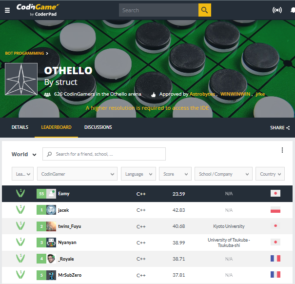
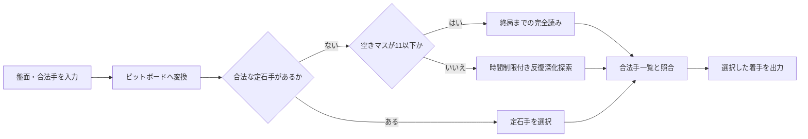

# CodinGame Othello AI

CodinGameの対戦型プログラミングゲーム「[Othello](https://www.codingame.com/multiplayer/bot-programming/othello-1)」に参加するために開発した思考AIです。

8×8の盤面と合法手を標準入力から受け取り、制限時間内に局面を探索して、選択した1手を標準出力へ返します。単に合法手を返すだけでなく、序盤の定石、中盤の評価関数付き探索、終盤の完全読みを組み合わせて対戦成績の向上を図っています。

## 対戦実績

- 最高順位: **55位 / 626人中（上位約8.8%）**
- Tier: **Wood 1**
- 記録日: **2026年7月10日**
- 使用言語: **C++**



順位は参加者数や対戦結果によって変動するため、本リポジトリでは取得時点の画像を記録として保存しています。

## 技術的な見どころ

### 1. 64bitビットボードによる盤面表現

黒石と白石の配置を、それぞれ1つの64bit整数で管理しています。合法手生成や反転対象の計算をビット演算で行い、探索中に多数発生する盤面処理の効率化を図っています。

### 2. 制限時間を考慮したゲーム木探索

C++版では、次の手法を組み合わせています。

- Minimax探索
- Alpha-Beta枝刈り
- Principal Variation Search（PVS）
- 深さ1から最大9までの反復深化
- Aspiration Window
- 境界種別と探索深度を保持する置換表
- 着手とUndoによる盤面の再利用

探索が制限時間内に完了しない場合は、最後まで完了した深さの結果を採用します。探索結果が得られない場合にも、入力された合法手からフォールバックできる構成です。

### 3. ゲーム進行に応じた着手選択

- **序盤**: 22本の定石へ回転・反転を適用した定石辞書から着手します。
- **中盤**: 位置、合法手数、潜在モビリティ、フロンティア石、確定石の近似などを評価して探索します。
- **終盤**: 空きマスが11以下の場合、終局までの完全読みを試み、最終石数差で着手を決定します。

### 4. CodinGameの実行条件への対応

- 通常手番では内部探索時間を0.12秒に設定
- 初期盤面付近では最大1.75秒を使用
- デバッグ情報は標準エラーへ分離
- 最終出力前にCodinGameから渡された合法手一覧と照合
- 入力終了時に正常終了するEOF処理を実装

## 着手決定の流れ



## 使用技術

| 分類 | 内容 |
|---|---|
| メイン実装 | C++17 |
| 別言語実装 | Python |
| 盤面表現 | 64bitビットボード |
| 探索 | Minimax、Alpha-Beta、PVS、反復深化、完全読み |
| 探索効率化 | 定石、手の並び替え、Aspiration Window、置換表 |
| 実行環境 | CodinGame標準入出力型対戦環境 |

## リポジトリ構成

```text
.
├─ src/
│  ├─ cpp/
│  │  └─ Othello_world_cup_ver_*.cpp  # C++17版の各バージョン
│  └─ python/
│     └─ Othello_world_cup.py        # Python版
├─ test/
│  ├─ run_othello_matches.bat        # 新旧AIの20局対戦を実行
│  └─ src/
│     └─ othello_match_runner.py     # ローカル対戦レフェリー
├─ docs/
│  ├─ Othello_AI_Detailed_Design.md
│  ├─ CodinGame_Othello_Official_Common_Rules_Specification.md
│  ├─ Othello_Local_Match_Test_Specification.md
│  └─ Othello_Local_Match_Environment_Setup_Guide.md
└─ ranking_evidence_img/           # ランキング結果の記録
```

## 実行方法

### CodinGameで実行する場合

1. CodinGameの[Othello](https://www.codingame.com/multiplayer/bot-programming/othello-1)を開きます。
2. `src/cpp/`にある提出対象のC++ファイルの内容をCodinGameのエディタへ貼り付けます。
3. 言語にC++を選択して実行します。
4. 対戦結果を確認し、リーグ戦へ提出します。

Pythonを使用する場合は、`src/python/Othello_world_cup.py`を貼り付け、言語にPythonを選択します。

### ローカルで新旧AIを対戦させる場合

AIを変更したときは、ローカル対戦用BATを使って旧版と新版を20局対戦させます。画面表示は行わず、各局の勝者、色、石数と、20局終了後の集計をコンソールへ表示します。

事前に次の環境が必要です。

- Windows PowerShell
- Python 3
- C++版を使用する場合は、C++17対応の`g++`

詳しい導入方法は[ローカル対戦環境構築ガイド](docs/Othello_Local_Match_Environment_Setup_Guide.md)を参照してください。

リポジトリルートで次のコマンドを実行します。

```powershell
.\test\run_othello_matches.bat
```

起動後、リポジトリルートからの相対パスで旧版と新版を入力します。

```text
old_cpp_file: src\cpp\Othello_world_cup_ver_1.cpp
new_cpp_file: src\cpp\Othello_world_cup_ver_2.cpp
new_change: Remove last move position score from evaluation
```

C++ファイルはBAT内で自動的にコンパイルされます。`new_change`には新版だけに加えた変更内容を入力します。その後、旧版と新版の黒・白を1局ごとに交代しながら20局実行します。各AIは黒と白をそれぞれ10局担当します。

```text
Match Information
NEW Change: Remove last move position score from evaluation
Games: 20

Game 1
Winner: NEW, Color=White, Stones=36
Loser: OLD, Color=Black, Stones=28

Final Summary
NEW Change: Remove last move position score from evaluation
OLD: Wins=3, Total Stones=274
NEW: Wins=7, Total Stones=360
Draws: 0
Overall Result: NEW is better (more wins).
```

優劣は勝数で判定します。勝数が同じ場合は20局の総石数を比較し、総石数も同じ場合は`TIE`です。対戦ルール、時間制限、不正手の扱いなどは[ローカル対戦テスト仕様書](docs/Othello_Local_Match_Test_Specification.md)を参照してください。

### ローカルでC++版をコンパイルする場合

```powershell
g++ -std=c++17 -O2 -o othello_ai.exe src\cpp\Othello_world_cup_ver_2.cpp
```

本プログラムはCodinGame形式の対話的な標準入力を前提としています。そのため、単独で起動しても対局画面は表示されません。入出力の詳細は共通ルール・入出力仕様書を参照してください。

## 設計資料

- [Othello AI 詳細設計書兼仕様書](docs/Othello_AI_Detailed_Design.md)  
  C++版のクラス構成、ビットボード、評価関数、探索、時間管理、既知の課題を実装に基づいて記載しています。
- [CodinGame Othello 公式共通ルール・入出力仕様書](docs/CodinGame_Othello_Official_Common_Rules_Specification.md)  
  ゲームルール、標準入出力、制限時間、異常系、テスト観点を整理しています。
- [ローカル対戦テスト仕様書](docs/Othello_Local_Match_Test_Specification.md)  
  新旧AIを20局対戦させるローカルレフェリーの入力、ルール、時間制限、勝敗判定、出力を定義しています。
- [ローカル対戦環境構築ガイド](docs/Othello_Local_Match_Environment_Setup_Guide.md)  
  WindowsへPython、MSYS2、GCCを導入し、対戦BATを実行するまでの手順を記載しています。
