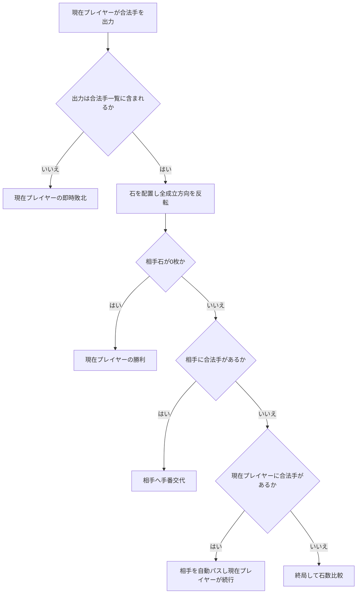
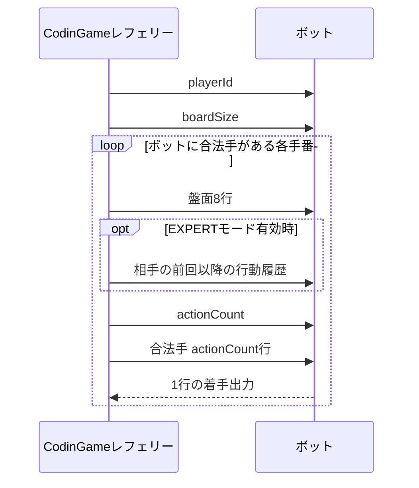

# CodinGame Othello（`othello-1`）公式共通ルール・入出力仕様書

## 1. 文書情報

| 項目 | 内容 |
|---|---|
| 文書名 | CodinGame Othello（`othello-1`）公式共通ルール・入出力仕様書 |
| 対象 | CodinGame Multiplayer Bot Programming「Othello」 |
| Pretty ID | `othello-1` |
| ゲーム形式 | 2人対戦・交互着手・完全情報ゲーム |
| 盤面 | 8×8固定 |
| 文書目的 | AI方式に依存しないゲーム共通ルール、合法手、パス、終局、勝敗、標準入出力、EXPERTモードを正確に定義する |
| 作成基準 | CodinGame公式説明と、公式説明からリンクされている公開レフェリー実装を照合する |
| 確認日 | 2026-07-10（JST） |
| 参考形式 | 添付の「Othello AI 詳細設計書兼仕様書」と同様に、実装・試験へ利用できる粒度で構成する |

---

## 2. 本書の位置付け

本書は、CodinGame上でOthelloボットを実装するための**外部仕様書兼共通ルール仕様書**です。

本書が定義する内容は次のとおりです。

1. 盤面、座標、初期配置
2. 黒・白とプレイヤーIDの対応
3. 合法手と反転処理
4. 手番、パス、連続手番
5. 終局条件と勝敗判定
6. CodinGameの初期入力・ターン入力・出力
7. `MSG`および`EXPERT`拡張
8. 制限時間、異常出力、敗北条件
9. 実装時の不変条件、試験観点、受入条件

次の内容は本書の対象外です。

- Minimax、Alpha-Beta、MCTSなどの探索方式
- 評価関数、定石、学習モデル
- ビットボードなどの内部データ構造
- 特定言語に依存するクラス設計
- ランキング戦略や強さを上げるための戦術

---

## 3. 仕様の根拠と優先順位

### 3.1 参照元

| 優先度 | 参照元 | 用途 |
|---:|---|---|
| 1 | [CodinGame公式ゲームページ](https://www.codingame.com/multiplayer/bot-programming/othello-1) | 現在公開されているゲーム概要、勝利・敗北条件の確認 |
| 2 | [公式説明文 `statement_en.html`](https://github.com/MultiStruct/Othello/blob/master/config/statement_en.html) | 共通ルール、入出力、EXPERTモード、制限時間の確認 |
| 3 | [公開レフェリー `Referee.java`](https://github.com/MultiStruct/Othello/blob/master/src/main/java/com/codingame/game/Referee.java) | 実際の手番遷移、出力判定、パス、終局、入力順の確認 |
| 4 | [盤面実装 `Board.java`](https://github.com/MultiStruct/Othello/blob/master/src/main/java/com/codingame/game/othello/Board.java) | 初期配置、8方向判定、合法手生成、反転処理の確認 |
| 5 | [座標実装 `Cell.java`](https://github.com/MultiStruct/Othello/blob/master/src/main/java/com/codingame/game/othello/Cell.java) | `a1`～`h8`の座標変換確認 |
| 6 | [方向定義 `Direction.java`](https://github.com/MultiStruct/Othello/blob/master/src/main/java/com/codingame/game/othello/Direction.java) | 判定対象となる8方向の確認 |
| 7 | [出力行数 `Player.java`](https://github.com/MultiStruct/Othello/blob/master/src/main/java/com/codingame/game/Player.java) | 1ターン1行出力の確認 |
| 8 | [生成コード定義 `stub.txt`](https://github.com/MultiStruct/Othello/blob/master/config/stub.txt) | 基本モードの入力順と型の補助確認 |

### 3.2 優先ルール

説明文とレフェリー実装の表現に差がある場合、本書では次の方針を採用します。

1. ゲームの基本ルールは公式説明文を正とします。
2. CodinGame上で実際に受理・拒否される入出力は公開レフェリー実装を正とします。
3. 公開レフェリー固有の挙動は「レフェリー実装仕様」と明記します。
4. 将来のレフェリー更新で変化し得る挙動は、移植可能な共通仕様と分離します。

### 3.3 用語上の強さ

| 表現 | 意味 |
|---|---|
| 必須 | 満たさない場合、ルール違反、入力ずれ、または敗北につながる要件 |
| 禁止 | 実行してはならない要件 |
| 推奨 | 現行環境での安全性・互換性を高める要件 |
| 実装仕様 | 公開レフェリーで確認できる挙動。一般的なオセロ規則より具体的な内容を含む |

---

## 4. ゲーム概要

### 4.1 目的

8×8盤上へ黒石と白石を置き、ゲーム終了時に相手より多くの石を所有することが目的です。

### 4.2 プレイヤー数

プレイヤー数は2人固定です。

| プレイヤーID | 盤面文字 | 石の色 | 表示上のプレイヤーカラー | 先後 |
|---:|---:|---|---|---|
| `0` | `'0'` | 黒 | 赤 | 先手 |
| `1` | `'1'` | 白 | 青 | 後手 |

> **注意:** CodinGameビューア上の赤・青はプレイヤー識別色です。石の色は、Player 0が黒、Player 1が白です。

### 4.3 ゲームの性質

- 盤面状態と着手履歴は両者へ公開されます。
- 同じ盤面へ同じ手を適用した結果は常に同じです。
- 1回の有効な着手で、新たに占有される空きマスは1マスです。
- 石は盤上から除去されず、色のみが反転します。

---

## 5. 盤面・座標仕様

## 5.1 盤面サイズ

| 仕様ID | 要件 |
|---|---|
| `BRD-001` | 盤面は8行×8列とします。 |
| `BRD-002` | マス数は64固定とします。 |
| `BRD-003` | 初期入力として`boardSize`を受け取りますが、現行ゲームでは値は`8`です。 |

## 5.2 座標系

列は左から右へ `a`～`h`、行は上から下へ `1`～`8`です。

```text
      a  b  c  d  e  f  g  h
   +-------------------------+
1  | a1 b1 c1 d1 e1 f1 g1 h1 |
2  | a2 b2 c2 d2 e2 f2 g2 h2 |
3  | a3 b3 c3 d3 e3 f3 g3 h3 |
4  | a4 b4 c4 d4 e4 f4 g4 h4 |
5  | a5 b5 c5 d5 e5 f5 g5 h5 |
6  | a6 b6 c6 d6 e6 f6 g6 h6 |
7  | a7 b7 c7 d7 e7 f7 g7 h7 |
8  | a8 b8 c8 d8 e8 f8 g8 h8 |
   +-------------------------+
```

| 仕様ID | 要件 |
|---|---|
| `BRD-010` | `a1`はビューアから見た左上です。 |
| `BRD-011` | `h8`はビューアから見た右下です。 |
| `BRD-012` | 正規の座標文字列は正規表現`^[a-h][1-8]$`に一致します。 |
| `BRD-013` | 盤面入力は1行目から8行目まで、上から下の順に送信されます。 |
| `BRD-014` | 各盤面行の文字は左から右へ`a`列から`h`列を表します。 |

## 5.3 盤面文字

| 文字 | 意味 |
|---|---|
| `.` | 空きマス |
| `0` | Player 0の黒石 |
| `1` | Player 1の白石 |

各マスは常に上記3状態のいずれか1つです。

---

## 6. 初期状態

## 6.1 初期配置

初期盤面には中央4マスへ石が置かれます。

- `d4`：白石（`1`）
- `e4`：黒石（`0`）
- `d5`：黒石（`0`）
- `e5`：白石（`1`）

```text
      a b c d e f g h
1     . . . . . . . .
2     . . . . . . . .
3     . . . . . . . .
4     . . . 1 0 . . .
5     . . . 0 1 . . .
6     . . . . . . . .
7     . . . . . . . .
8     . . . . . . . .
```

標準入力上の8行は次のとおりです。

```text
........
........
........
...10...
...01...
........
........
........
```

> **重要:** 行4は`...10...`、行5は`...01...`です。盤面配列の上下方向や、黒白を表す文字を逆に実装しないでください。

## 6.2 初手

黒であるPlayer 0が必ず先手です。

初期盤面における黒の合法手集合は次の4手です。

```text
{ c4, d3, e6, f5 }
```

この集合の**入力順は戦略上の優先度を表しません**。順序へ依存せず処理してください。

---

## 7. 共通ゲームルール

## 7.1 判定方向

合法手判定と反転判定は、着手マスを起点とする次の8方向で行います。

| 方向 | 列差 | 行差 |
|---|---:|---:|
| 北 | 0 | -1 |
| 北東 | +1 | -1 |
| 東 | +1 | 0 |
| 南東 | +1 | +1 |
| 南 | 0 | +1 |
| 南西 | -1 | +1 |
| 西 | -1 | 0 |
| 北西 | -1 | -1 |

## 7.2 合法手の必要十分条件

空きマス`m`への着手が合法であるためには、次の条件をすべて満たす必要があります。

1. `m`が盤内であること。
2. `m`が空きマスであること。
3. 8方向のうち少なくとも1方向で、`m`の直隣が相手石であること。
4. その方向へ1枚以上の相手石が連続していること。
5. 連続した相手石列の直後に、自分の石が存在すること。
6. 上記条件を満たす方向において、相手石を1枚以上反転できること。

形式的には、プレイヤー`P`、相手`O`、方向ベクトル`d`について、ある整数`k >= 1`が存在し、次を満たす場合にその方向は成立します。

```text
m + d, m + 2d, ..., m + kd   はすべて相手石 O
m + (k + 1)d                 は自分石 P
```

少なくとも1方向が成立すれば、`m`は合法手です。

| 仕様ID | 要件 |
|---|---|
| `MOV-001` | 占有済みマスへの着手は禁止します。 |
| `MOV-002` | 盤外座標への着手は禁止します。 |
| `MOV-003` | 1枚以上を反転できない着手は禁止します。 |
| `MOV-004` | 相手石列の先が空きマスまたは盤外の場合、その方向では反転しません。 |
| `MOV-005` | 隣接マスが自分石の場合、その方向では反転しません。 |
| `MOV-006` | 少なくとも1方向が成立する場合に限り、着手できます。 |

## 7.3 反転処理

合法手を適用するときは、次の順で処理します。

1. 選択した空きマスへ自分の石を1枚置きます。
2. 8方向を独立に調べます。
3. 成立した各方向について、着手石と終端の自分石に挟まれた相手石をすべて自分色へ反転します。
4. 複数方向が成立した場合、成立したすべての方向を反転します。
5. 反転終了後の盤面を次の手番判定へ使用します。

| 仕様ID | 要件 |
|---|---|
| `FLP-001` | 反転対象は、着手マスから一直線上に連続する相手石のみです。 |
| `FLP-002` | 間に空きマスを含む石列は反転対象になりません。 |
| `FLP-003` | 途中に自分石が現れた時点で、その方向の走査を終了します。 |
| `FLP-004` | 成立する全方向を同一着手内で反転します。 |
| `FLP-005` | 着手そのものにより、占有マス数は必ず1増えます。 |

## 7.4 合法手判定の擬似コード

```text
function isLegalMove(board, player, move):
    if move is outside board:
        return false

    if board[move] is not empty:
        return false

    opponent = 1 - player

    for each direction in 8 directions:
        current = move + direction
        opponentCount = 0

        while current is inside board and board[current] == opponent:
            opponentCount += 1
            current += direction

        if opponentCount >= 1
           and current is inside board
           and board[current] == player:
            return true

    return false
```

## 7.5 着手適用の擬似コード

```text
function applyMove(board, player, move):
    require isLegalMove(board, player, move)

    board[move] = player
    opponent = 1 - player

    for each direction in 8 directions:
        current = move + direction
        captured = empty list

        while current is inside board and board[current] == opponent:
            captured.add(current)
            current += direction

        if captured is not empty
           and current is inside board
           and board[current] == player:
            for each cell in captured:
                board[cell] = player
```

---

## 8. 手番・パス仕様

## 8.1 通常の手番遷移

合法手を適用した後、相手に1手以上の合法手がある場合、手番を相手へ移します。

## 8.2 自動パス

相手に合法手がなく、着手したプレイヤーにはまだ合法手がある場合、相手は自動的にパスします。その後、着手したプレイヤーがもう一度行動します。

| 仕様ID | 要件 |
|---|---|
| `PAS-001` | 合法手がないプレイヤーの手番はレフェリーが自動的に飛ばします。 |
| `PAS-002` | プレイヤーは自分の判断で任意にパスできません。 |
| `PAS-003` | 合法手が存在する場合、いずれかの合法手を必ず出力します。 |
| `PAS-004` | 基本出力として`PASS`を出力してはなりません。 |
| `PAS-005` | パスされたプレイヤーのボットは、そのパス手番では実行されません。 |
| `PAS-006` | 相手が連続してパスする場合、同じプレイヤーが複数回連続で着手します。 |

> **最重要事項:** このゲームでは「合法手がなければ`PASS`を出力する」のではありません。合法手がないプレイヤーはレフェリーによって自動的にスキップされます。ボットが呼び出された時点では、現行レフェリー上、少なくとも1つの合法手が用意されています。

## 8.3 両者に合法手がない場合

着手後に相手にも自分にも合法手がない場合、ゲームを終了します。

## 8.4 手番遷移フロー



---

## 9. 終局・勝敗仕様

## 9.1 通常終局条件

次のいずれかでゲームを終了します。

1. 両プレイヤーに合法手がない。
2. 盤面がすべて埋まる。
3. 初期4石の後に最大60回の有効着手が行われる。
4. 着手後、相手の石数が0枚になる。これは公開レフェリーの即時終了条件です。
5. いずれかのプレイヤーが不正出力またはタイムアウトにより失格する。

## 9.2 石数による結果

通常終局時は黒石数と白石数を比較します。

| 条件 | 結果 |
|---|---|
| 黒石数 > 白石数 | Player 0の勝利 |
| 黒石数 < 白石数 | Player 1の勝利 |
| 黒石数 = 白石数 | 引き分け |

## 9.3 不正・タイムアウト時の結果

不正な出力、認識不能なコマンド、または制限時間超過が発生したプレイヤーは、その時点で敗北します。石数比較は行いません。

## 9.4 レフェリー内部スコア

公開レフェリーでは、通常勝者へ`1`、通常敗者へ`0`、引き分けでは双方`0`が設定されます。不正出力またはタイムアウトしたプレイヤーには`-1`が設定されます。

この内部スコアは盤上の石数そのものではありません。

---

## 10. CodinGame実行モデル

## 10.1 対話型プログラム

ボットは、ゲーム開始時に初期入力を読み、その後はゲームが終了するまで次の処理を繰り返します。

1. 現在盤面を読む。
2. 必要に応じてEXPERT追加入力を読む。
3. 合法手数を読む。
4. 合法手一覧を読む。
5. 制限時間内に1手を選ぶ。
6. 標準出力へ1行出力し、フラッシュする。

## 10.2 入出力シーケンス



---

## 11. 初期入力仕様

ゲーム開始後、各ボットは自身の最初の行動前に次の2行を受け取ります。

```text
playerId
boardSize
```

| 順序 | 名称 | 型 | 値・意味 |
|---:|---|---|---|
| 1 | `playerId` | 整数 | 自分のID。`0`または`1` |
| 2 | `boardSize` | 整数 | 行数および列数。現行値は`8` |

### 11.1 実装要件

| 仕様ID | 要件 |
|---|---|
| `IN-INI-001` | `playerId`はゲームループの外で1回読みます。 |
| `IN-INI-002` | `boardSize`はゲームループの外で1回読みます。 |
| `IN-INI-003` | `playerId == 0`なら自分は黒、`playerId == 1`なら自分は白です。 |
| `IN-INI-004` | 内部実装が8×8固定でも、入力行数の制御には受信した`boardSize`を利用する実装が安全です。 |

---

## 12. 1ターン分の入力仕様（基本モード）

基本モードでは、1回の行動要求ごとに次の順序で入力されます。

```text
盤面行 × boardSize
判断可能な合法手数 actionCount
合法手 × actionCount
```

## 12.1 盤面行

次の8行が、上から下へ送信されます。

```text
row1
row2
row3
row4
row5
row6
row7
row8
```

各行は8文字で、左から右へ`a`～`h`列を表します。

## 12.2 合法手数

盤面行の直後に、合法手の件数`actionCount`が1行で送信されます。

## 12.3 合法手一覧

続く`actionCount`行に、現在のボットが選択できる合法手が1件ずつ送信されます。

```text
4
c4
d3
e6
f5
```

上記は集合の例です。実際の並び順は保証対象としません。

| 仕様ID | 要件 |
|---|---|
| `IN-TURN-001` | 盤面は、ボットが次の手を置く直前の状態です。 |
| `IN-TURN-002` | 合法手一覧は、その盤面と現在プレイヤーに対応します。 |
| `IN-TURN-003` | ボットは、原則として受信した合法手一覧を出力合法性の最終的な基準とします。 |
| `IN-TURN-004` | 合法手一覧の順序に戦略的意味があると仮定してはなりません。 |
| `IN-TURN-005` | 現行レフェリーでは、行動を要求される手番の`actionCount`は通常1以上です。 |
| `IN-TURN-006` | 基本モードでは、盤面8行の直後が`actionCount`です。 |

## 12.4 初期盤面入力例

Player 0へ初期盤面が送られた場合の概念例です。合法手の並び順は一例です。

```text
0
8
........
........
........
...10...
...01...
........
........
........
4
c4
d3
e6
f5
```

---

## 13. 出力仕様

## 13.1 基本出力

1ターンにつき、標準出力へ1行だけ出力します。

```text
d3
```

出力する座標は、受信した合法手一覧のいずれかとします。

| 仕様ID | 要件 |
|---|---|
| `OUT-001` | 1ターンの期待出力行数は1行です。 |
| `OUT-002` | 正規形式は小文字の`a1`～`h8`です。 |
| `OUT-003` | 出力座標は受信した合法手一覧に含まれなければなりません。 |
| `OUT-004` | 出力後は直ちに標準出力をフラッシュします。 |
| `OUT-005` | デバッグ文字列を着手行の前後へ別行で標準出力してはなりません。 |
| `OUT-006` | デバッグ用途には標準エラー出力を使用することを推奨します。 |
| `OUT-007` | `PASS`は正規の着手出力ではありません。 |

## 13.2 メッセージ付き出力

着手の後へ`MSG`を付けると、ビューア用メッセージを出力できます。

```text
d3 MSG hello
```

公開レフェリーはメッセージ部分を先頭から最大12文字まで保持します。メッセージは着手合法性や勝敗判定には影響しません。

### 13.2.1 注意事項

- `MSG`は公開レフェリー上、大文字で解釈されます。
- 小文字の`msg`は正規形式として扱わないでください。
- メッセージ内へ追加の`MSG`を含めないでください。
- 移植性を重視する場合、着手座標のみを出力するのが最も安全です。

## 13.3 現行レフェリーの正規化

公開レフェリーでは、着手部分について次の正規化が行われます。

1. `EXPERT`を処理します。
2. すべての空白文字を除去します。
3. 小文字へ変換します。
4. 合法手一覧と完全一致比較します。

したがって大文字座標や余分な空白が受理される場合がありますが、これは正規形式ではありません。ボットは常に小文字2文字の座標を出力してください。

---

## 14. EXPERTモード仕様

## 14.1 目的

通常入力では現在盤面と合法手一覧が与えられるため、単純な着手選択には十分です。

EXPERTモードを有効化すると、次回以降の自分の手番で「前回の自分の行動以降に相手が行った手またはパス」の履歴を追加で受け取れます。相手がパスし、同じプレイヤーが連続して複数手を打った場合の履歴復元に利用できます。

## 14.2 有効化方法

着手出力の先頭へ大文字の`EXPERT`を付けます。

```text
EXPERT d3
```

メッセージを併用する場合は次の形式です。

```text
EXPERT d3 MSG hello
```

| 仕様ID | 要件 |
|---|---|
| `EXP-001` | `EXPERT`は大文字で出力します。 |
| `EXP-002` | `EXPERT`だけを出力せず、同じ行に合法手を含めます。 |
| `EXP-003` | 有効化したターンの着手自体も通常どおり合法でなければなりません。 |
| `EXP-004` | 一度有効化すると、そのボットでは以後の手番でも有効状態が継続します。 |
| `EXP-005` | 追加入力は有効化した出力の直後ではなく、次回以降にそのボットが入力を受けるときに現れます。 |

## 14.3 EXPERT有効時のターン入力順

EXPERTモード有効後は、盤面8行と`actionCount`の間に履歴行が1行追加されます。

```text
盤面行 × 8
opponentHistory
actionCount
合法手 × actionCount
```

基本モードとの差は、次の1行です。

```text
opponentHistory
```

## 14.4 履歴行形式

履歴行は、相手の行動をセミコロン`;`で区切った文字列です。

```text
c4;
```

相手が複数回連続で着手した場合は、複数の座標が入ります。

```text
c4;f5;e6;
```

相手がパスした場合は、小文字の`pass`が入ります。

```text
pass;
```

| 仕様ID | 要件 |
|---|---|
| `EXP-010` | 各要素は座標または`pass`です。 |
| `EXP-011` | 要素は`;`で区切られます。 |
| `EXP-012` | 公開レフェリーでは末尾にも`;`が付きます。 |
| `EXP-013` | 相手が複数回連続で着手した場合、複数手が時系列順に含まれます。 |
| `EXP-014` | `pass`はEXPERT履歴用の値であり、ボット出力用コマンドではありません。 |

## 14.5 EXPERT入力例

黒が初手に`EXPERT d3`を出力してEXPERTモードを有効化し、その後に白が`c3`へ着手したとします。次の黒手番で受信する入力の概念例は次のとおりです。合法手の並び順は一例です。

```text
........
........
..10....
...10...
...01...
........
........
........
c3;
4
b3
c4
e6
f5
```

この例では、盤面8行の後に相手履歴`c3;`があり、その次に合法手数`4`があります。

## 14.6 実装上の警告

EXPERTを有効化したにもかかわらず、基本モードと同じ読み取り処理を続けると、履歴行を`actionCount`として読もうとして入力がずれます。

そのため、EXPERTを使用する場合は、自分のプログラム内で有効化状態を保持し、次回から必ず追加行を読み取ってください。

---

## 15. 制限時間

| 対象 | 制限時間 |
|---|---:|
| 各ボットの最初の行動 | 2000 ms以下 |
| 2回目以降の各行動 | 150 ms以下 |

| 仕様ID | 要件 |
|---|---|
| `TIM-001` | 最初の行動では2000 ms以内に1行出力します。 |
| `TIM-002` | 2回目以降は各行動150 ms以内に1行出力します。 |
| `TIM-003` | 制限時間超過時は即時敗北します。 |
| `TIM-004` | 外部制限ぎりぎりまで処理せず、安全マージンを設けることを推奨します。 |
| `TIM-005` | 初期化、入力解析、探索、出力までを含む実時間として管理します。 |

---

## 16. 不正出力・敗北条件

出力は、正規化後に合法手一覧のいずれかと完全一致しなければなりません。

次の出力は不正です。

| No. | 不正内容 | 例 | 結果 |
|---:|---|---|---|
| 1 | 盤外座標 | `i4`, `a9` | 即時敗北 |
| 2 | 占有済みマス | 既に石がある`d4` | 即時敗北 |
| 3 | 空きだが反転できないマス | 初期盤面の`a1` | 即時敗北 |
| 4 | 合法手一覧にない座標 | 任意の非合法手 | 即時敗北 |
| 5 | 認識できない文字列 | `move d3` | 即時敗北 |
| 6 | `PASS`の出力 | `PASS` | 現行レフェリーでは即時敗北 |
| 7 | 出力なし | 空行・プロセス停止 | 即時敗北 |
| 8 | 制限時間超過 | 150 ms超過など | 即時敗北 |
| 9 | `MSG`の小文字使用 | `d3 msg test` | 着手部が不正文字列化し得る |
| 10 | `EXPERT`の小文字使用 | `expert d3` | EXPERTとして認識されず不正手になり得る |

> 公開レフェリーは「盤内か」「空きか」だけでなく、生成済み合法手一覧との一致で判定します。そのため、盤内の空きマスでも反転できない手は不正です。

---

## 17. レフェリー処理仕様

## 17.1 1回の行動処理

公開レフェリーの挙動を、外部仕様として整理すると次のとおりです。

```text
1. 現在プレイヤーへ入力を送る。
2. 現在プレイヤーを制限時間付きで実行する。
3. 標準出力の先頭1行を取得する。
4. MSG部分を分離する。
5. EXPERT指定があれば有効化する。
6. 着手部分から空白を除去し、小文字化する。
7. 着手が合法手一覧に含まれるか調べる。
8. 含まれなければ現在プレイヤーを失格させ、ゲーム終了。
9. 含まれれば着手と全方向の反転を適用する。
10. 相手石が0枚なら現在プレイヤー勝利で終了。
11. 相手に合法手があれば相手へ交代する。
12. 相手に合法手がなく、自分に合法手があれば相手を自動パスする。
13. 両者に合法手がなければ石数を比較して終了する。
```

## 17.2 入力される合法手の信頼性

ボットは必要に応じて自前の合法手生成を実装できますが、**CodinGameへ出力できる手の最終集合は入力された合法手一覧**です。

自前計算結果と入力一覧が一致しない場合は、次の優先順位を推奨します。

1. 出力合法性の保証には入力一覧を使用する。
2. 自前計算との差分を標準エラーへ記録する。
3. 少なくとも入力一覧の先頭手へフォールバックできるようにする。

---

## 18. 状態不変条件

盤面・手番処理では、常に次の条件が成立しなければなりません。

| 仕様ID | 不変条件 |
|---|---|
| `INV-001` | `黒石数 + 白石数 + 空きマス数 = 64` |
| `INV-002` | 1マスが同時に黒石と白石になることはありません。 |
| `INV-003` | 合法手の着手先は必ず空きマスです。 |
| `INV-004` | 1回の合法手で空きマス数は正確に1減ります。 |
| `INV-005` | 1回の合法手で少なくとも1枚の相手石が反転します。 |
| `INV-006` | 反転対象以外の既存石は変化しません。 |
| `INV-007` | 石が盤上から削除されることはありません。 |
| `INV-008` | 手番を与えられたプレイヤーには少なくとも1つの合法手があります。 |
| `INV-009` | 両者に合法手がなければ、それ以上着手を要求しません。 |
| `INV-010` | 通常終局時の勝敗は最終石数の大小だけで決まります。 |

---

## 19. 具体例

## 19.1 初期盤面から黒が`d3`へ着手

初期盤面で黒が`d3`へ置くと、南方向にある`d4`の白石が、`d5`の黒石との間に挟まれるため黒へ反転します。

### 着手前

```text
........
........
........
...10...
...01...
........
........
........
```

### 着手後

```text
........
........
...0....
...00...
...01...
........
........
........
```

### 石数

| 色 | 着手前 | 着手後 |
|---|---:|---:|
| 黒 | 2 | 4 |
| 白 | 2 | 1 |

### 次の白の合法手集合

```text
{ c3, c5, e3 }
```

## 19.2 非合法手の例

初期盤面で黒が`a1`へ置こうとしても、隣接方向に「1枚以上の白石列、その先の黒石」という形が存在しません。そのため`a1`は空きマスであっても非合法です。

## 19.3 複数方向の反転

ある着手が横・縦・斜めの複数方向で条件を満たす場合、1方向だけを選ぶことはできません。成立した全方向の相手石を同一手番内で反転します。

## 19.4 パスの例

```text
プレイヤーAが着手
  ↓
プレイヤーBの合法手が0件
  ↓
プレイヤーAの合法手は1件以上
  ↓
Bは自動パス
  ↓
Aが再度入力を受け、もう1手着手
```

このときBは`PASS`を出力せず、Bのプログラム自体が実行されません。

---

## 20. 実装時の推奨処理

## 20.1 最小安全実装

強さを考慮しない最小ボットでも、次を満たせば合法手を返せます。

1. 初期入力を読む。
2. 毎ターン盤面8行を読む。
3. `actionCount`を読む。
4. 合法手をすべて読む。
5. 合法手一覧のいずれか、例えば先頭を出力する。
6. 出力をフラッシュする。

## 20.2 自前合法手生成を行う場合

探索AIでは着手後盤面の生成が必要なため、自前の合法手生成・反転処理が必要になることがあります。その場合も、ルートで最終出力する直前に次のガードを入れることを推奨します。

```text
if selectedMove is included in inputLegalActions:
    output selectedMove
else:
    output inputLegalActions[0]
```

## 20.3 時間管理

- 最初の手は2000 msを使い切らず、余裕を残してください。
- 通常手番は150 msのため、100～130 ms程度を内部上限とする設計が安全です。
- 言語起動時間、GC、標準出力フラッシュ、OSスケジューリングも考慮してください。
- 途中までしか完了していない探索結果より、必ず合法なフォールバック手を優先してください。

## 20.4 標準出力と標準エラー

| 出力先 | 用途 |
|---|---|
| 標準出力 | レフェリーへ渡す着手1行のみ |
| 標準エラー | 探索深さ、評価値、経過時間などのデバッグ情報 |

---

## 21. よくある誤解と正しい仕様

| 誤解 | 正しい仕様 |
|---|---|
| 合法手がないときは`PASS`を出力する | レフェリーが自動パスし、そのボットを呼び出しません |
| Player 0は表示が赤なので赤石である | Player 0の石は黒で、盤面文字は`0`です |
| Player 1は表示が青なので青石である | Player 1の石は白で、盤面文字は`1`です |
| `a1`は左下である | `a1`は左上です |
| 行番号は下から上へ増える | 行番号は上から下へ1～8です |
| 初期行4は`...01...`である | 現行レフェリーでは行4が`...10...`です |
| 空きマスならどこへ置いてもよい | 1方向以上で相手石を挟み、1枚以上反転できる必要があります |
| 1方向だけ反転すればよい | 成立したすべての方向を反転します |
| 合法手一覧の先頭が最善手である | 一覧順に戦略的な保証はありません |
| `actionCount`が0なら`PASS`を返す | 現行レフェリーは自動パスし、通常は0件の行動要求を送りません |
| `EXPERT`は別行で出力する | 合法手と同じ1行へ`EXPERT d3`のように出力します |
| EXPERTを有効化しても入力形式は同じ | 次回から盤面と`actionCount`の間に履歴行が1行増えます |
| `pass`は出力コマンドである | `pass`はEXPERT履歴内の相手行動表現です |

---

## 22. テスト仕様

## 22.1 座標テスト

| テストID | 条件 | 期待結果 |
|---|---|---|
| `T-COORD-001` | 左上マス | `a1` |
| `T-COORD-002` | 右上マス | `h1` |
| `T-COORD-003` | 左下マス | `a8` |
| `T-COORD-004` | 右下マス | `h8` |
| `T-COORD-005` | 全64マスを座標化して逆変換 | 元の行列へ戻る |

## 22.2 初期盤面テスト

| テストID | 条件 | 期待結果 |
|---|---|---|
| `T-INIT-001` | `d4` | 白`1` |
| `T-INIT-002` | `e4` | 黒`0` |
| `T-INIT-003` | `d5` | 黒`0` |
| `T-INIT-004` | `e5` | 白`1` |
| `T-INIT-005` | その他60マス | 空き`.` |
| `T-INIT-006` | 黒合法手 | `{c4,d3,e6,f5}` |

## 22.3 合法手テスト

| テストID | 条件 | 期待結果 |
|---|---|---|
| `T-MOVE-001` | 空きマス・相手石1枚・終端に自石 | 合法 |
| `T-MOVE-002` | 空きマス・相手石複数枚・終端に自石 | 合法 |
| `T-MOVE-003` | 隣接が空き | その方向は不成立 |
| `T-MOVE-004` | 隣接が自石 | その方向は不成立 |
| `T-MOVE-005` | 相手石列の先が空き | その方向は不成立 |
| `T-MOVE-006` | 相手石列の先が盤外 | その方向は不成立 |
| `T-MOVE-007` | 占有済みマス | 非合法 |
| `T-MOVE-008` | 1方向も成立しない空きマス | 非合法 |
| `T-MOVE-009` | 2方向以上が成立 | 合法、全方向を反転 |

## 22.4 反転テスト

| テストID | 条件 | 期待結果 |
|---|---|---|
| `T-FLIP-001` | 初期盤面で黒`d3` | `d4`が黒へ反転 |
| `T-FLIP-002` | 横方向の挟み込み | 横の連続相手石のみ反転 |
| `T-FLIP-003` | 縦方向の挟み込み | 縦の連続相手石のみ反転 |
| `T-FLIP-004` | 斜め方向の挟み込み | 斜めの連続相手石のみ反転 |
| `T-FLIP-005` | 複数方向同時成立 | 各方向の全対象石を反転 |
| `T-FLIP-006` | 着手後の占有数 | 着手前より1増える |

## 22.5 パス・終局テスト

| テストID | 条件 | 期待結果 |
|---|---|---|
| `T-PASS-001` | 相手のみ合法手0 | 相手を自動パスし同じプレイヤーが続行 |
| `T-PASS-002` | 両者合法手0 | 即時終局し石数比較 |
| `T-PASS-003` | 合法手があるのに`PASS`出力 | 不正出力 |
| `T-END-001` | 黒石が多い終局 | Player 0勝利 |
| `T-END-002` | 白石が多い終局 | Player 1勝利 |
| `T-END-003` | 石数同数 | 引き分け |
| `T-END-004` | 着手後に相手石0 | 着手プレイヤーの即時勝利 |

## 22.6 入出力テスト

| テストID | 条件 | 期待結果 |
|---|---|---|
| `T-IO-001` | 初期入力 | `playerId`、`boardSize`を正しく取得 |
| `T-IO-002` | 基本ターン入力 | 盤面8行後に`actionCount`を読む |
| `T-IO-003` | 合法手1件 | その1件を必ず出力 |
| `T-IO-004` | 合法手複数件 | 一覧中の1件を出力 |
| `T-IO-005` | `d3 MSG hello` | `d3`として処理される |
| `T-IO-006` | 盤外座標 | 即時敗北 |
| `T-IO-007` | 空きだが非合法な座標 | 即時敗北 |
| `T-IO-008` | 出力遅延 | 制限超過時に敗北 |
| `T-IO-009` | 標準エラーへデバッグ出力 | 着手判定へ影響しない |

## 22.7 EXPERTテスト

| テストID | 条件 | 期待結果 |
|---|---|---|
| `T-EXP-001` | `EXPERT d3` | `d3`を適用しEXPERTを有効化 |
| `T-EXP-002` | 次回自手番 | 盤面後に履歴行が1行追加される |
| `T-EXP-003` | 相手が1手 | `d3;`形式で取得 |
| `T-EXP-004` | 相手が複数手 | `c4;f5;...;`形式で取得 |
| `T-EXP-005` | 相手がパス | `pass;`を取得 |
| `T-EXP-006` | EXPERT未対応パーサー | 入力ずれを検出できること |

---

## 23. 受入条件

本仕様へ準拠するボットまたはローカル対戦基盤は、最低限次を満たす必要があります。

1. 8×8盤を正しい向きで読み取れること。
2. `0`を黒、`1`を白、`.`を空きとして解釈できること。
3. Player 0が黒先手、Player 1が白後手であることを扱えること。
4. 初期配置が`d4=白、e4=黒、d5=黒、e5=白`であること。
5. 8方向の合法手判定が正しいこと。
6. 1方向以上で1枚以上を挟む手だけを合法とすること。
7. 成立した全方向の石を反転すること。
8. 合法手がないプレイヤーを自動パスさせること。
9. `PASS`を通常の着手として出力しないこと。
10. 両者に合法手がない場合、石数で勝敗判定すること。
11. 同数の場合、引き分けとすること。
12. 初期入力2行をゲームループ外で読めること。
13. 基本モードで盤面8行、合法手数、合法手一覧を順に読めること。
14. 出力が必ず入力合法手一覧のいずれかであること。
15. 各ターンの標準出力を1行に限定し、フラッシュすること。
16. 初回2000 ms、以降150 msの制限内で応答すること。
17. EXPERTを使用する場合、追加履歴行を正しい位置で読めること。
18. 不正座標、非合法手、認識不能な出力を拒否できること。
19. タイムアウト時に失格としてゲームを終了できること。
20. 主要ルールへ対応する単体テストまたは回帰テストが存在すること。

---

## 24. 実装チェックリスト

### 入力

- [ ] `playerId`を最初に1回だけ読む
- [ ] `boardSize`を最初に1回だけ読む
- [ ] 毎ターン8行の盤面を読む
- [ ] EXPERT使用時だけ履歴行を追加で読む
- [ ] `actionCount`件の合法手をすべて読む
- [ ] 合法手順序へ依存しない

### 盤面

- [ ] `a1`を左上として扱う
- [ ] 行4を`...10...`、行5を`...01...`として初期化する
- [ ] 8方向を判定する
- [ ] 相手石1枚以上と終端自石を確認する
- [ ] 成立した全方向を反転する

### 出力

- [ ] 合法手一覧内の手だけを出力する
- [ ] 小文字2文字の座標を使う
- [ ] 1ターン1行だけ標準出力する
- [ ] 出力後にフラッシュする
- [ ] `PASS`を出力しない
- [ ] `MSG`、`EXPERT`を使う場合は大文字にする

### 安全性

- [ ] 常に合法なフォールバック手を保持する
- [ ] 通常ターンは150 msより前に探索を打ち切る
- [ ] デバッグは標準エラーへ出す
- [ ] 自前合法手と入力合法手の差分を検出できる
- [ ] EOFまたはゲーム終了時に正常終了できる

---

## 25. 用語集

| 用語 | 定義 |
|---|---|
| 合法手 | 盤内の空きマスで、1方向以上に相手石を1枚以上挟んで反転できる着手 |
| 非合法手 | 盤外、占有済み、または1枚も反転できない着手 |
| 反転 | 挟まれた相手石の所有者を現在プレイヤーへ変更する処理 |
| パス | 合法手がないプレイヤーの手番をレフェリーが自動的に飛ばす処理 |
| 連続手番 | 相手がパスした結果、同じプレイヤーが再度着手すること |
| 終局 | それ以上ゲームを継続せず、勝敗または引き分けを確定する状態 |
| `actionCount` | 現在プレイヤーが選べる合法手の件数 |
| `MSG` | 着手へビューア表示用メッセージを付ける拡張キーワード |
| `EXPERT` | 相手の前回以降の行動履歴を追加入力として受け取るモードを有効化するキーワード |
| `pass` | EXPERT履歴内で、相手の自動パスを示す文字列 |
| レフェリー | 入力送信、出力検証、盤面更新、パス、終局、勝敗を管理するCodinGame側プログラム |

---

## 26. 仕様上の重要ポイント要約

1. 盤面は8×8、`a1`は左上です。
2. Player 0は黒・先手・盤面文字`0`です。
3. Player 1は白・後手・盤面文字`1`です。
4. 初期配置は行4が`...10...`、行5が`...01...`です。
5. 合法手は、1方向以上で相手石を1枚以上挟める空きマスです。
6. 複数方向が成立した場合、全方向を反転します。
7. 合法手がない場合、レフェリーが自動パスします。
8. ボットは`PASS`を出力しません。
9. 出力は入力合法手一覧のいずれか1件です。
10. 初回制限は2000 ms、以降は150 msです。
11. EXPERT有効後は、盤面と`actionCount`の間に履歴行が増えます。
12. 通常終局は最終石数が多い側の勝利、同数は引き分けです。
13. 不正手、認識不能な出力、タイムアウトは即時敗北です。

---

## 27. 結論

CodinGame版Othelloは、標準的な8×8オセロの挟み込み・反転規則を採用しつつ、対戦ボット向けに現在盤面と合法手一覧を毎手番入力する構成です。

実装上もっとも重要な相違点は、**合法手がないときにボットが`PASS`を返すのではなく、レフェリーが自動的に手番を飛ばす**ことです。また、Player 0・Player 1と黒白、盤面文字、ビューア表示色を混同しないこと、初期盤面の上下・黒白配置を正しく扱うことが必要です。

AIの探索方式にかかわらず、最終出力を必ず入力合法手一覧へ照合し、時間切れ前に合法なフォールバック手を返す構成が、CodinGame環境での共通要件となります。
