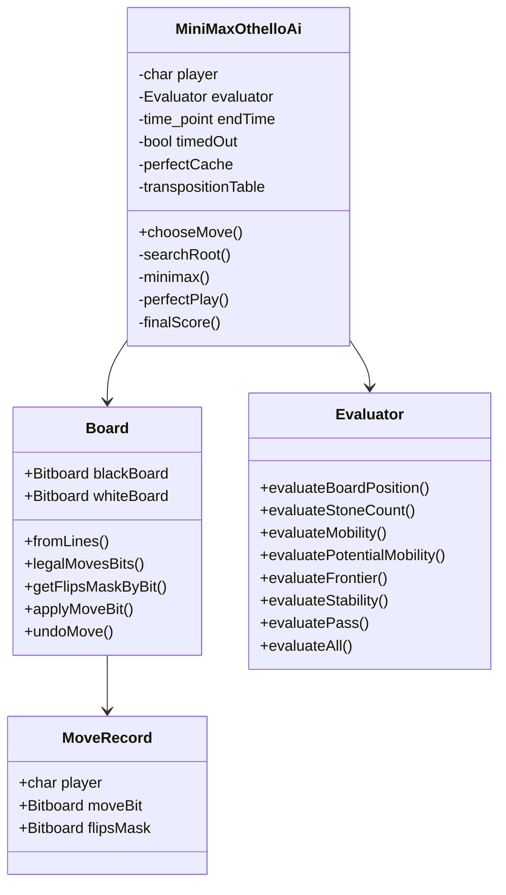
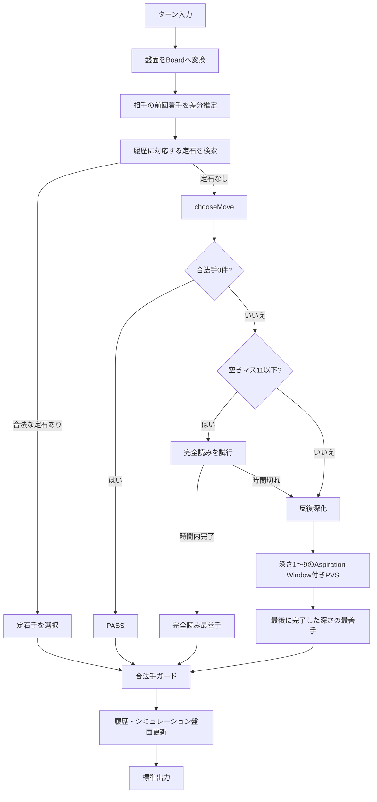
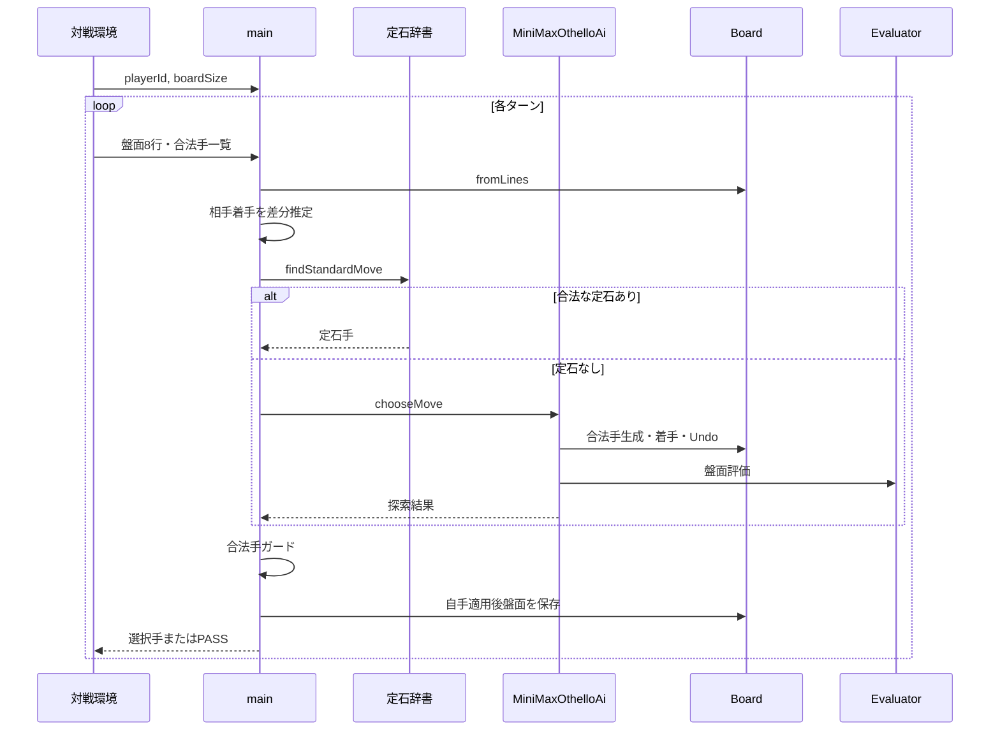

# Othello AI 詳細設計書兼仕様書

## 1. 文書情報

| 項目 | 内容 |
|---|---|
| 文書名 | Othello AI 詳細設計書兼仕様書 |
| 対象ソース | `Othello_world_cup.cpp` |
| 対象言語 | C++17 |
| 対象実行環境 | CodinGame の標準入出力型対戦環境を想定 |
| 文書目的 | 現行実装の外部仕様、内部構造、アルゴリズム、制約、注意点をコードに基づいて明文化する |
| 作成方針 | 実装済みコードを正とし、確認できない意図は推測せず「未定義」または「実装上の挙動」として記載する |
| 参考資料 | https://monstar-lab.com/dx/solution/howto-specification/ |

---

## 2. 本書の位置付け

本書は、要求仕様書、外部仕様書、内部仕様書のうち、主に次の2つを兼ねます。

1. **機能仕様書**  
   AIがどの入力を受け取り、どのような規則で手を選び、何を出力するかを定義します。
2. **技術仕様書・詳細設計書**  
   ビットボード、定石辞書、評価関数、Minimax探索、Alpha-Beta枝刈り、PVS、反復深化、Aspiration Window、完全読み、置換表の実装方式を定義します。

画面を持たない標準入出力プログラムであるため、画面設計・画面遷移設計は対象外です。その代わり、ターンごとの入出力シーケンスとクラス間の処理関係を記載します。

---

## 3. システム概要

### 3.1 目的

8×8のオセロ盤面と、そのターンに選択可能な合法手一覧を受け取り、制限時間内で1手を選択して標準出力へ返します。

### 3.2 AIの基本方針

着手選択は、次の優先順位で行います。

1. 現在の着手履歴に対応する合法な定石手が存在する場合、定石手を選択する。
2. 定石手が存在しない場合、探索AIで手を選択する。
3. 空きマスが11以下の場合、可能であれば終局まで完全探索する。
4. 完全探索が時間内に完了しない場合、深さ1から最大9までの反復深化Minimax探索を行う。
5. 探索が途中で時間切れになった場合、最後に完了した探索深さの最善手を採用する。
6. 選択結果が入力された合法手一覧に存在しない場合、先頭の合法手へフォールバックする。
7. 合法手がない場合は `PASS` を出力する。

### 3.3 対象範囲

- 盤面文字列の読み込み
- 64bitビットボードへの変換
- 合法手生成
- 反転石計算
- 着手・Undo
- 定石選択
- 相手着手履歴の推定
- 盤面評価
- Minimax探索
- Alpha-Beta枝刈り
- PVS
- 反復深化
- Aspiration Window
- 通常探索用置換表
- 終盤完全読み
- 終盤探索キャッシュ
- 時間管理
- 標準出力
- デバッグ情報の標準エラー出力

### 3.4 対象外

- GUI
- ネットワーク通信
- 永続化
- 学習機能
- 対局結果からの自動重み更新
- 定石データの外部ファイル読み込み
- 並列探索
- MSVC固有環境への移植保証

---

## 4. 前提条件・制約

| 項目 | 仕様 |
|---|---|
| 盤面サイズ | 8×8固定 |
| 使用ビット数 | 64bit符号なし整数 |
| プレイヤー0 | 文字 `'0'`、黒石 |
| プレイヤー1 | 文字 `'1'`、白石 |
| 空きマス | `'.'` |
| 手の表記 | `a1`～`h8` |
| コンパイル規格 | C++17 |
| ビット演算 | GCC/Clang系組み込み関数 `__builtin_popcountll`、`__builtin_ctzll` を使用 |
| 探索時間 | 通常0.12秒、盤上の石が5個以下なら1.75秒 |
| 通常探索最大深さ | 9 |
| 完全読み開始条件 | 空きマス11以下 |
| 出力 | 合法手1件、または `PASS` |

`boardSize` は入力から受け取りますが、内部ロジック、重み表、ビット配置は8×8固定です。したがって、実質的には `boardSize = 8` が必須です。

---

## 5. 入出力仕様

## 5.1 初期入力

プログラム開始時に次の2項目を読み込みます。

```text
playerId
boardSize
```

| 項目 | 型 | 内容 |
|---|---|---|
| `playerId` | 整数 | 0または1 |
| `boardSize` | 整数 | 想定値8 |

`playerId` は `'0' + playerId` により文字へ変換されます。0と1以外の入力は想定していません。

## 5.2 ターン入力

各ターンで次の順序により入力します。

```text
盤面文字列 × boardSize行
actionCount
合法手 × actionCount行
```

### 盤面文字列

各行は8文字を想定します。

```text
........
........
........
...01...
...10...
........
........
........
```

### 合法手一覧

```text
4
d3
c4
f5
e6
```

入力された手は小文字へ変換されます。

## 5.3 出力

各ターンにつき、次のいずれかを標準出力へ1行出力します。

```text
f5
```

または

```text
PASS
```

`std::endl` を使用するため、出力時にフラッシュされます。

## 5.4 デバッグ出力

探索状況は標準エラー出力へ出力します。

| 条件 | 出力例 |
|---|---|
| 定石を使用 | `standard=f5` |
| 通常探索完了 | `depth=5 score=120` |
| 完全読み完了 | `perfect score=300000` |
| 不正手ガード発動 | `invalid selected action guarded=f5` |

標準出力とは分離されるため、対戦手の出力形式には影響しません。

---

## 6. 座標・ビットボード仕様

## 6.1 ビット配置

盤面位置 `(row, column)` は次の式でビット番号へ変換します。

```text
bitIndex = row × 8 + column
```

- `a1` = bit 0
- `b1` = bit 1
- `h1` = bit 7
- `a2` = bit 8
- `h8` = bit 63

盤面表現は次のとおりです。

```text
       a  b  c  d  e  f  g  h
1      0  1  2  3  4  5  6  7
2      8  9 10 11 12 13 14 15
3     16 17 18 19 20 21 22 23
4     24 25 26 27 28 29 30 31
5     32 33 34 35 36 37 38 39
6     40 41 42 43 44 45 46 47
7     48 49 50 51 52 53 54 55
8     56 57 58 59 60 61 62 63
```

## 6.2 盤面保持

`Board` は次の2つのビットボードを保持します。

| メンバー | 内容 |
|---|---|
| `blackBoard` | プレイヤー0の石がある位置 |
| `whiteBoard` | プレイヤー1の石がある位置 |

空きマス専用のデータは保持せず、次の式で求めます。

```text
emptyBits = ~(blackBoard | whiteBoard)
```

64bit型であるため、反転結果も64マスの範囲に収まります。

## 6.3 端の回り込み防止

東西・斜め方向のシフトでは、A列またはH列をマスクしてから移動します。

| 定数 | 値・意味 |
|---|---|
| `FILE_A` | A列の全ビット |
| `FILE_H` | H列の全ビット |
| `NOT_A_FILE` | A列以外 |
| `NOT_H_FILE` | H列以外 |

例として東方向は、H列のビットを除外してから左へ1bitシフトします。これにより `h1` が `a2` に回り込むことを防ぎます。

## 6.4 8方向シフト

| 関数 | ビット移動 |
|---|---:|
| `shiftNorth` | `>> 8` |
| `shiftSouth` | `<< 8` |
| `shiftEast` | H列除外後 `<< 1` |
| `shiftWest` | A列除外後 `>> 1` |
| `shiftNorthEast` | H列除外後 `>> 7` |
| `shiftNorthWest` | A列除外後 `>> 9` |
| `shiftSouthEast` | H列除外後 `<< 9` |
| `shiftSouthWest` | A列除外後 `<< 7` |

---

## 7. 全体構成



---

## 8. 定石機能仕様

## 8.1 定石データ

22本の定石手順を、各手2文字を連結した文字列としてソース内に保持します。

例：

```text
f5d6c3g5c6c5...
```

外部ファイルからの読み込みはありません。

## 8.2 定石の展開

起動時に `buildStandardBook()` を実行し、各定石へ次の8種類の盤面対称変換を適用します。

1. 変換なし
2. 90度回転
3. 180度回転
4. 270度回転
5. 上下反転
6. 上下反転後の90度相当変換
7. 上下反転後の180度相当変換
8. 上下反転後の270度相当変換

各変換後の手順について、すべての履歴接頭辞をキーとして次手候補を登録します。

例：

```text
履歴キー ""       -> f5 等
履歴キー "f5"     -> d6 等
履歴キー "f5d6"   -> c3 等
```

同じ履歴・同じ次手は重複登録しません。

## 8.3 定石選択

`findStandardMove()` は、実戦履歴を連結した文字列をキーに定石辞書を検索します。

1. 履歴キーが存在しなければ定石なし。
2. 候補を登録順に確認する。
3. 入力された合法手一覧に含まれる最初の候補を返す。
4. 候補がすべて非合法なら定石なし。

定石手には探索評価を行いません。合法であれば即時採用します。

## 8.4 履歴管理

AI自身の手は、出力直前に `historyActions` へ追加します。

相手の手は、AIが前回自分の手を適用したシミュレーション盤面と、次ターンに入力された現在盤面との差分から推定します。

```text
newBits = currentPlayerBits & ~previousOccupied
```

これは「前回の盤面では空きで、現在は相手石になっているマス」を相手の新規着手位置とみなす方式です。反転した石は前回も占有済みであるため、新規着手として扱われません。

AIが白の場合、初回ターンでは標準初期盤面との差分から黒の初手を補完します。

---

## 9. Boardクラス詳細設計

## 9.1 `fromLines`

**目的**: 8行の文字盤面を2つのビットボードへ変換します。

**処理**:

1. 全64マスを走査する。
2. 文字が `'0'` なら黒ビットを立てる。
3. 文字が `'1'` なら白ビットを立てる。
4. その他の文字は空きマスとして扱う。

入力文字数や盤面矛盾の検証は行いません。

## 9.2 `legalMovesBits`

**目的**: 指定プレイヤーの合法手を64bitで一括生成します。

**方向単位の処理**:

1. 自石を1マスシフトし、相手石と重なる位置を候補列とする。
2. 候補列をさらに同方向へシフトし、相手石が連続する範囲を拡張する。
3. 最大5回拡張する。
4. 候補列の1マス先が空きマスなら合法手に加える。

初回取得1枚と追加5回により、最大6枚の連続相手石をたどれます。8×8盤の合法手生成では、着手マスと終端の自石を除く最大反転枚数が6枚であるため、この回数で盤端まで対応します。

## 9.3 `getLegalMoveBitsList`

合法手集合から最下位の1bitを順に取り出します。

```text
moveBit = movesBits & (-movesBits相当)
```

C++実装では符号なし演算として次を使用します。

```cpp
movesBits & (~movesBits + 1ULL)
```

取り出し順はビット番号の昇順です。その後、探索前に手位置重みで並び替えられます。

## 9.4 `getFlipsForDirection`

指定した1方向の反転対象を求めます。

1. 着手位置の隣が相手石なら走査開始。
2. 相手石が続く限り `captured` に加える。
3. その先に自石があれば、蓄積した相手石を反転対象として返す。
4. 空きマスまたは盤外なら0を返す。

## 9.5 `getFlipsMaskByBit`

1. 着手位置が占有済みなら0を返す。
2. 8方向の反転対象をOR結合する。
3. 合法手かどうかの明示検証は行わず、反転対象がない場合は0となる。

## 9.6 `applyMoveBit`

盤面を直接更新します。

黒の場合：

```text
blackBoard |= moveBit | flipsMask
whiteBoard &= ~flipsMask
```

白の場合は逆です。

Undoに必要なプレイヤー、着手位置、反転マスクを `MoveRecord` として返します。

## 9.7 `undoMove`

`MoveRecord` を使い、着手石を除去し、反転石を相手側へ戻します。

探索中は盤面オブジェクトのコピーを毎ノード作成せず、`applyMoveBit` と `undoMove` を対にして使用します。

---

## 10. 評価関数仕様

評価値は、常に `rootPlayer`、すなわち探索開始側プレイヤーにとって大きいほど有利です。

総合評価は次の合計です。

```text
総合評価
= 位置評価
+ 石数評価
+ 確定合法手数評価
+ 潜在モビリティ評価
+ フロンティア評価
+ 確定石近似評価
+ パス評価
```

## 10.1 位置評価 `evaluateBoardPosition`

自石の位置重みを加算し、相手石の位置重みを減算します。

主な重み：

| マス種別 | 重み例 |
|---|---:|
| 角 | +3000 |
| 角の斜め隣 | -800 |
| 角の辺隣 | -500 |
| 一部の安定しやすい内側 | +20 |
| 中央付近 | 0 |

角を非常に高く評価し、角を取られる危険が高いX打ち・C打ちを大きく減点する設計です。

## 10.2 着手位置評価 `evaluateMoveScoreByBit`

手の探索順に使用します。

| マス種別 | 重み例 |
|---|---:|
| 角 | +1000 |
| 角の斜め隣 | -900 |
| 角の辺隣 | -800 |
| 辺の一部 | +50～100 |

Alpha-Beta枝刈りを効かせるため、高評価手から探索します。総合評価には加算しません。

## 10.3 パス評価 `evaluatePass`

```text
(opponentPassCount - myPassCount) × 50
```

- 相手のパスが多いほど加点
- 自分のパスが多いほど減点

パス回数は現在の探索経路上で累積し、着手してもリセットされません。

## 10.4 石数評価 `evaluateStoneCount`

ゲーム進行度で評価方針を変えます。

| 空きマス | 評価式 | 意味 |
|---:|---|---|
| 自石0 | `-2147483647` | ほぼ敗北扱い |
| 40以上 | `(相手石 - 自石) × 2` | 序盤は石を取りすぎるほど減点 |
| 15～39 | 0 | 中盤は石数を評価しない |
| 14以下 | `(自石 - 相手石) × 5` | 終盤は石数差を評価 |

序盤で石数が少ない側を有利とするのは、相手へ多くの手を与えないための一般的なオセロ戦略を簡易的に反映したものです。

## 10.5 モビリティ評価 `evaluateMobility`

```text
(自分の合法手数 - 相手の合法手数) × 30
```

合法手の選択肢が多い盤面を高く評価します。

## 10.6 潜在モビリティ評価 `evaluatePotentialMobility`

- 相手石に隣接する空きマスを、自分の将来的な候補として数える。
- 自石に隣接する空きマスを、相手の将来的な候補として数える。

```text
(自分側潜在数 - 相手側潜在数) × 3
```

これは厳密な将来合法手ではなく、隣接関係のみを用いた近似です。

## 10.7 フロンティア評価 `evaluateFrontier`

空きマスに隣接している石をフロンティア石とします。

```text
(相手フロンティア石数 - 自分フロンティア石数) × 5
```

自分のフロンティア石が少ないほど高評価です。

## 10.8 確定石近似評価 `evaluateStability`

角を所有している場合、その角から横方向・縦方向へ連続する同色石を数えます。

```text
(自分側カウント - 相手側カウント) × 30
```

注意事項：

- 盤面全体の厳密な確定石判定ではありません。
- 角および角から連続する2辺だけを評価します。
- 同じ角を起点とする角石は1回だけ数えます。
- 1つの辺が両角から埋まっている場合、辺石が重複して数えられる可能性があります。

## 10.9 終局スコア `finalScore`

```text
(自石数 - 相手石数) × 100000
```

通常評価より十分大きな値を使い、探索上で勝敗を優先します。

- 1石勝ち = +100000
- 1石負け = -100000
- 引き分け = 0

勝敗のみではなく、石数差も最大化・最小化します。

---

## 11. 着手選択フロー



---

## 12. 通常探索仕様

## 12.1 反復深化

深さ1から開始し、最大9まで1ずつ深くします。

各深さについて、ルートの全合法手を評価し終えた場合のみ、その深さの最善手を確定します。途中で時間切れになった深さの結果は採用しません。

初期のフォールバック最善手は、入力された合法手一覧の先頭です。ただし探索前に合法手配列は位置重み順へ並び替えられます。探索が1深さも完了しなかった場合、返る手は並び替え前に保存した元の先頭手です。

直前に完了した深さの最善手は、次の深さのルート探索で最初に調べます。直前深さの評価値は、深さ2以降のAspiration Windowの中心値としても使用します。

## 12.2 Minimax

- ルートプレイヤーの手番：評価値を最大化
- 相手の手番：評価値を最小化

深さは手番が移るたびに1減少します。パス時も1減少します。

## 12.3 Alpha-Beta枝刈りとPVS

最大化ノードでは `alpha`、最小化ノードでは `beta` を更新します。

```text
beta <= alpha
```

となった時点で残りの兄弟手を探索しません。

ルートを含む通常探索にはPVSを適用します。

1. 各ノードの最初の手は、受け取った通常のAlpha-Beta窓で探索する。
2. 最大化ノードの2手目以降は `[alpha, alpha + 1]` のNull Windowで探索する。
3. 最小化ノードの2手目以降は `[beta - 1, beta]` のNull Windowで探索する。
4. Null Windowの結果が現在の最善値を超え、かつ親の探索窓内にある場合は、通常窓で再探索する。

評価値は整数であるため、幅1の窓をNull Windowとして使用します。通常窓で必要な再探索を行うことで、十分な探索時間がある場合のMinimax評価値を維持します。

## 12.4 手の並び順

通常探索用置換表に最善手が保存されている場合は、その手を先頭へ移動します。保存済み最善手がない場合、および先頭手以外の並び順には `MOVE_WEIGHTS` の降順を使用します。

- 角を先に探索
- 危険なX打ち・C打ちは後に探索

ルートでは、反復深化の直前に完了した深さの最善手も優先手として使用します。Aspiration Windowの再探索時は、直前の探索で得た最善手を優先します。

良い手を先に調べることで、Alpha-Beta枝刈りとPVSのNull Windowによる枝刈りの発生率を高めます。

## 12.5 通常探索用置換表

置換表のキー：

| フィールド | 内容 |
|---|---|
| `blackBoard` | 黒盤面 |
| `whiteBoard` | 白盤面 |
| `currentPlayer` | 現在手番 |
| `rootPlayer` | 評価基準プレイヤー |
| `myPassCount` | ルートプレイヤーの累積パス回数 |
| `opponentPassCount` | 相手の累積パス回数 |
| `lastMoveBit` | 直前手 |
| `hasLastMove` | 直前手の有無 |

盤面と現在手番に加え、通常評価値へ影響する評価コンテキストもキーに含めます。

置換表の値：

| フィールド | 内容 |
|---|---|
| `searchedDepth` | 探索を完了した深さ |
| `score` | 評価値 |
| `bestMoveBit` | その探索で得た最善手。手がない場合は0 |
| `boundType` | `EXACT`、`LOWER_BOUND`、`UPPER_BOUND` のいずれか |

保存済みの `searchedDepth` が現在必要な深さ以上の場合のみ、評価値と境界を探索窓へ適用します。

- `EXACT`：保存評価値をそのまま返す。
- `LOWER_BOUND`：`alpha`を保存評価値以上へ更新する。
- `UPPER_BOUND`：`beta`を保存評価値以下へ更新する。
- 更新後に `beta <= alpha` なら、そのノードの探索を省略する。

保存深さが不足している場合も、`bestMoveBit` は手順並べ替えに使用します。置換表は `chooseMove()` の探索開始時にクリアし、同一ターンの反復深化とAspiration Window再探索の間で保持します。

同じキーへ結果を保存する場合は深い探索を優先し、同一深度では `EXACT` を境界値より優先します。時間切れになった再帰経路の結果は保存しません。

## 12.6 Aspiration Window

深さ1は `[-INF, INF]` の全幅で探索します。深さ2以降は、直前に完了した深さの評価値を中心に狭い窓を設定します。

初期半幅は、既存の `MOVE_WEIGHTS` の最大値である1,000です。これは1手の着手位置評価に使用している既存スケールを根拠とします。

探索結果が次の条件を満たした場合は窓外と判定します。

- `score <= alpha`：fail-low
- `score >= beta`：fail-high

失敗時は半幅を2倍にして再探索します。3回目の失敗後は `[-INF, INF]` の全幅探索へ戻します。窓外だった探索結果は、その深さの完了結果として採用しません。全幅を含む最終探索が完了した場合だけ、最善手と評価値を次の反復深化へ引き継ぎます。

## 12.7 深さ到達時

`depth <= 0` になると `Evaluator::evaluateAll()` を実行して評価値を返します。

この評価値は現在深度における `EXACT` として通常探索用置換表へ保存します。ただし、同じキーにより深い探索結果がある場合は置き換えません。

## 12.8 通常探索中の終盤移行

通常Minimax中であっても、空きマスが11以下になった時点で `perfectPlay()` へ切り替えます。

## 12.9 パス処理

現在プレイヤーに合法手がない場合：

1. 相手にも合法手がなければ終局。
2. 相手に合法手があれば盤面を変更せず手番を交代。
3. パスした側に応じてパス回数を加算。
4. 深さを1減らす。
5. 直前手なしとして次ノードへ進む。

## 12.10 時間切れ処理

Minimaxの先頭および各手の探索前に時刻を確認します。

時間切れ時：

1. `timedOut = true` にする。
2. その時点の盤面を通常評価関数で評価して返す。
3. 上位呼び出しでは `timedOut` を検知し、未完了深さを破棄する。
4. `timedOut` が立った再帰経路の結果は通常探索用置換表へ保存しない。

盤面のUndoは、再帰から戻った直後に必ず実行されます。

---

## 13. 終盤完全読み仕様

## 13.1 開始条件

空きマスが11以下の場合、終局までの全手順探索を試みます。

## 13.2 評価

途中盤面のヒューリスティック評価は使わず、両者とも合法手がなくなった終局で `finalScore()` を返します。

したがって、時間内に完了した場合は、現行探索モデルにおける終局石差の最善手を返します。

## 13.3 パス

合法手がないが相手に合法手がある場合、同一盤面のまま手番のみ交代します。連続パスで両者に合法手がなければ終局です。

## 13.4 完全読みキャッシュ

キー：

| フィールド | 内容 |
|---|---|
| `blackBoard` | 黒盤面 |
| `whiteBoard` | 白盤面 |
| `currentPlayer` | 現在手番 |
| `rootPlayer` | 評価基準プレイヤー |

値：

| フィールド | 内容 |
|---|---|
| `score` | 終局まで探索した評価値または境界値 |
| `bestMoveBit` | その探索で得た最善手。手がない場合は0 |
| `boundType` | `EXACT`、`LOWER_BOUND`、`UPPER_BOUND` のいずれか |

キャッシュは `chooseMove()` の開始ごとにクリアされ、ターンをまたいで保持しません。

キャッシュに最善手がある場合は、その手を最初に探索します。最善手がない場合、および残りの手は `MOVE_WEIGHTS` の降順で探索します。

## 13.5 完全読みの時間切れ

時間切れ時は `timedOut = true` とし、その時点の盤面へ `finalScore()` を適用して返します。

これは未終局盤面であっても現在石数差を終局相当の係数で返す挙動です。ただしルート側では時間切れを検知し、完全読み結果を確定結果として採用しません。

時間切れを検知した再帰経路では、着手済みの盤面を `undoMove()` で元に戻し、その探索結果を完全読みキャッシュへ保存しません。

## 13.6 境界種別の保存と参照

探索開始時の `alpha` と `beta` を保持し、探索結果を次の境界種別で保存します。

- `score <= originalAlpha`：`UPPER_BOUND`
- `score >= originalBeta`：`LOWER_BOUND`
- 上記以外：`EXACT`

両者に合法手がない終局では `finalScore()` が確定するため、探索窓にかかわらず `EXACT` として保存します。

キャッシュ参照時の処理は次のとおりです。

1. `EXACT` なら保存評価値をそのまま返す。
2. `LOWER_BOUND` なら `alpha` を保存評価値以上へ更新する。
3. `UPPER_BOUND` なら `beta` を保存評価値以下へ更新する。
4. 更新後に `beta <= alpha` なら、その局面の残りの探索を省略して保存評価値を返す。
5. 枝刈りできない場合は、更新後の窓で探索を続ける。

既存の `EXACT` エントリを境界値で上書きしません。これにより、Alpha-Beta枝刈りで得た境界値を確定値として扱うことを防ぎます。

---

## 14. 時間管理仕様

| 条件 | 制限時間 |
|---|---:|
| 盤上の石数が5個以下 | 1.75秒 |
| その他 | 0.12秒 |

初期盤面は4石であるため、最初期の探索には1.75秒が設定されます。ただし定石手が見つかった場合、探索自体は実行されません。

時間計測には `std::chrono::steady_clock` を使用します。システム時刻変更の影響を受けない単調時計です。

安全マージンは別途設定されていません。制限時間ちょうどまで探索するため、実行環境の入出力・スケジューリング事情によっては外部制限に近づく可能性があります。

---

## 15. メイン処理シーケンス



---

## 16. メソッド一覧

## 16.1 共通関数

| 関数 | 役割 |
|---|---|
| `debug` | 標準エラーへログ出力 |
| `opponentOf` | 相手プレイヤー取得 |
| `bitIndex` | 行列からbit番号取得 |
| `bitMask` | 行列から1bitマスク生成 |
| `bitToPosition` | 1bitから行列取得 |
| `actionToPosition` | `f5`から行列取得 |
| `actionToBit` | `f5`から1bit取得 |
| `positionToAction` | 行列から`f5`生成 |
| `bitToAction` | 1bitから`f5`生成 |
| `shiftNorth`ほか | 各方向のビット移動 |
| `neighborBits` | 8方向の隣接マス集合取得 |
| `splitStandardLine` | 定石文字列を2文字単位へ分割 |
| `transformPosition` | 座標の回転・反転 |
| `createHistoryKey` | 手履歴の連結キー生成 |
| `buildStandardBook` | 定石辞書構築 |
| `findStandardMove` | 履歴に対応する合法定石取得 |
| `inferNewMoves` | 盤面差分による相手手推定 |

## 16.2 `Board`

| メソッド | 役割 |
|---|---|
| `fromLines` | 文字盤面から生成 |
| `copy` | 盤面複製 |
| `occupiedBoard` | 占有マス取得 |
| `playerBoard` | 指定側の石取得 |
| `opponentBoard` | 相手側の石取得 |
| `countStones` | 石数取得 |
| `countEmptyCells` | 空きマス数取得 |
| `legalMovesBits` | 合法手一括生成 |
| `getLegalMoveBitsList` | 合法手を1bit単位へ分解 |
| `getFlipsForDirection` | 1方向の反転石取得 |
| `getFlipsMaskByBit` | 8方向の反転石取得 |
| `applyMoveBit` | 着手適用 |
| `undoMove` | 着手取消 |

## 16.3 `Evaluator`

| メソッド | 役割 |
|---|---|
| `evaluateBoardPosition` | 位置重み評価 |
| `evaluateMoveScoreByBit` | 手位置評価 |
| `evaluatePass` | パス差評価 |
| `evaluateStoneCount` | 進行度別石数評価 |
| `evaluateMobility` | 合法手数差評価 |
| `evaluatePotentialMobility` | 潜在手数近似評価 |
| `evaluateFrontier` | フロンティア石評価 |
| `countStableLineFromCorner` | 角からの連続石数取得 |
| `evaluateStability` | 確定石近似評価 |
| `evaluateAll` | 全評価の合算 |

## 16.4 `MiniMaxOthelloAi`

| メソッド | 役割 |
|---|---|
| コンストラクタ | AI担当色初期化 |
| `isTimeUp` | 探索期限判定 |
| `sortMoves` | 保存済み最善手を先頭、残りを位置重み順に並べ替え |
| `chooseMove` | 最終的な手選択 |
| `searchRoot` | ルート局面のPVS探索 |
| `determineBoundType` | 探索窓と評価値から境界種別を判定 |
| `storeTransposition` | 通常探索結果を深度・境界種別付きで保存 |
| `storeExactTransposition` | 深さ到達または終局の確定値を保存 |
| `storePerfectCache` | 完全読み結果を境界種別付きで保存 |
| `minimax` | PVSによる深さ制限探索 |
| `perfectPlay` | 終局までの探索 |
| `finalScore` | 終局石差評価 |

---

## 17. 正常系仕様

### 17.1 定石が存在する

- 履歴一致かつ合法な定石候補を返す。
- 探索は行わない。
- 定石使用ログを標準エラーへ出す。

### 17.2 定石が存在しない

- 探索AIを実行する。
- 完了した最深の反復深化結果を返す。

### 17.3 合法手がない

- `PASS` を返す。
- 盤面をそのまま次回差分比較用に保存する。

### 17.4 両者に合法手がない

探索内部では終局と判定し、石数差に基づく終局スコアを返します。

### 17.5 空きマス11以下

- 完全読みを優先する。
- 完了すれば完全読み結果を採用する。
- 時間切れなら通常探索へフォールバックする。

---

## 18. 防御処理・異常系仕様

## 18.1 選択手の合法性ガード

定石または探索が返した手が、入力された合法手一覧に存在しない場合：

1. 標準エラーへ警告を出す。
2. 合法手一覧が空でなければ先頭手を採用する。
3. 空なら `PASS` を採用する。

## 18.2 入力終了

盤面行の読み込みに失敗した場合、`main` は0で終了します。これは対戦終了時のEOFを想定しています。

## 18.3 未検証入力

次の入力検証は実装されていません。

- `playerId` が0または1であること
- `boardSize` が8であること
- 盤面行が8文字であること
- 盤面文字が `0`、`1`、`.` のいずれかであること
- 黒白ビットが重複しないこと
- 合法手表記が `a1`～`h8` であること
- 入力合法手が実際の盤面上でも合法であること

対戦環境が正しい入力を提供する前提です。

## 18.4 `__builtin_ctzll(0)`

`__builtin_ctzll(0)` の結果は未定義ですが、現行コードでは次の前提により0を渡さない設計です。

- `bitToPosition` は実際の1手ビットにのみ使用する。
- 評価時は `while (bits != 0)` 内で最下位bitを抽出する。
- `evaluateMoveScoreByBit` は合法手にのみ使用する。

この前提が破られた場合の防御処理はありません。

---

## 19. 性能特性

## 19.1 盤面操作

- 合法手生成：8方向をビット並列処理
- 石数計算：CPU組み込みpopcount
- bit位置取得：CPU組み込みcount trailing zeros
- 着手：定数個のbit演算
- Undo：定数個のbit演算

## 19.2 探索

通常探索の最悪計算量は概念上 `O(b^d)` です。

- `b`: 平均合法手数
- `d`: 探索深さ、最大9

実際にはAlpha-Beta枝刈り、PVS、Aspiration Window、置換表、手順並び替え、時間制限により探索量を削減します。

## 19.3 メモリ

- 盤面1件：主に64bit×2
- 通常探索：再帰スタック、合法手vector、`unordered_map` 置換表
- 完全読み：再帰スタック＋`unordered_map` キャッシュ
- 定石：起動時に22本×8対称形×各接頭辞を展開

定石辞書、通常探索用置換表、完全読みキャッシュに明示的なサイズ上限はありません。2つの探索表は `chooseMove()` の探索開始時にクリアされ、ターンをまたいで保持されません。

---

## 20. 現行仕様上の注意点・既知の技術的課題

| No. | 内容 | 影響 |
|---:|---|---|
| 1 | 時間安全マージンがない | 実行環境によっては外部制限に近づく可能性 |
| 2 | 探索表に明示的なサイズ上限がない | 局面数が多いターンではメモリ使用量が増える可能性 |
| 3 | 確定石評価が角からの辺のみ | 厳密な安定石評価ではない |
| 4 | パス回数を手が進んでも累積 | 「連続パス」ではなく探索経路全体のパス数評価 |
| 5 | 定石は履歴完全一致 | 転置によって同一盤面へ到達しても履歴が違えば一致しない |
| 6 | 相手手推定は盤面差分依存 | 入力盤面が想定外の場合、履歴を誤推定する可能性 |
| 7 | `boardSize`可変入力だが内部は8固定 | 8以外では正しく動作しない |
| 8 | GCC/Clang組み込み関数を使用 | MSVCではそのままコンパイルできない |
| 9 | 完全読み時間切れ時に未終局石差を終局係数化 | 途中値自体は厳密な評価ではないが、ルートでは結果を破棄する |
| 10 | 定石候補は登録順で選択 | 複数候補間の評価比較は行わない |
| 11 | 合法手ガード時は入力先頭手 | 先頭手が戦略的に最善とは限らない |

---

## 21. テスト観点

## 21.1 座標変換

- `a1` ↔ bit 0
- `h1` ↔ bit 7
- `a8` ↔ bit 56
- `h8` ↔ bit 63
- すべてのマスで往復変換が一致すること

## 21.2 シフト

- 東西方向で行をまたがないこと
- 斜め方向でA列・H列をまたがないこと
- 盤外へ出たbitが消えること

## 21.3 合法手

- 初期盤面の黒合法手が4件であること
- 初期盤面の白合法手が4件であること
- 端で6枚連続する反転候補を認識すること
- 合法手なし盤面で0を返すこと

## 21.4 反転・Undo

- 1方向反転
- 複数方向同時反転
- 端・角での反転
- 着手後にUndoすると黒白盤面が完全一致すること
- ランダム合法局面で着手・Undoを多数回繰り返して一致すること

## 21.5 評価

- 角取得で大幅加点されること
- X打ちで減点されること
- 序盤では自石が多いほど石数評価が下がること
- 中盤では石数評価が0になること
- 終盤では石数差が正方向に評価されること
- 相手をパスさせると加点されること

## 21.6 定石

- 空履歴で初手候補を取得できること
- 8対称形すべてで対応手が取得できること
- 定石候補が合法手一覧にない場合は採用しないこと
- 履歴が1手でも違えば該当しないこと

## 21.7 探索

- 合法手1件なら必ずその手を返すこと
- 両者パスで終局すること
- 自分のみパスの場合に相手へ手番を渡すこと
- 深さ完了前の時間切れ結果を採用しないこと
- 時間切れ時も着手済み盤面がすべてUndoされること
- 時間切れになった再帰経路の結果を探索表へ保存しないこと
- 通常置換表は保存深度が必要深度以上の場合だけ評価値を再利用すること
- 保存深度が不足していても最善手を手順並べ替えに利用すること
- `EXACT`、`LOWER_BOUND`、`UPPER_BOUND` を探索窓へ正しく反映すること
- 置換表または直前反復の最善手を最初に探索すること
- PVSと全幅Alpha-Betaの最善評価値が一致すること
- Aspiration Windowのfail-low・fail-high時に窓を拡張すること
- Aspiration Window再探索が完了しない場合、直前に完了した深さの結果を維持すること
- 空き11以下で完全読みへ入ること
- 完全読み完了時に最大石差手を返すこと

## 21.8 入出力

- 大文字の合法手を小文字化すること
- EOFで正常終了すること
- デバッグ出力が標準出力へ混入しないこと
- 出力手が常に入力合法手または`PASS`であること

## 21.9 Python版との回帰比較

同一盤面に対して以下を比較することが望まれます。

- 黒・白の合法手bit
- 各合法手の反転マスク
- 着手後盤面
- 各評価項目
- 総合評価
- 時間制限を十分長くした場合の探索手
- 残り11マス以下の終局スコア

時間依存の最終着手は実行速度差で変わり得るため、比較時は探索深さ固定または時間制限無効化が必要です。

---

## 22. 改修時の影響範囲

### 22.1 位置重み変更

変更対象：

- `POSITION_WEIGHTS`
- `MOVE_WEIGHTS`

影響：

- `POSITION_WEIGHTS`は通常評価
- `MOVE_WEIGHTS`は探索順
- Alpha-Beta効率

## 22.2 完全読み閾値変更

変更対象：

- `PERFECT_EMPTY_LIMIT`

値を増やすと終盤精度向上の可能性がありますが、探索量とタイムアウト率が増加します。

## 22.3 時間制限変更

変更対象：

- `chooseMove()` 内の `timeLimitSeconds`

外部対戦環境のターン制限を確認し、安全マージンを含めて設定する必要があります。

## 22.4 盤面サイズ変更

現在の実装は多数箇所で8×8および64bitを前提としているため、定数変更だけでは対応できません。

影響対象：

- ビット型
- シフト量
- ファイルマスク
- 重み配列
- 定石
- 座標表記
- 最大連続石数
- 初期盤面

## 22.5 探索表変更

通常探索用置換表または完全読みキャッシュのキー、置換方針、境界判定を変更する場合は、次の項目へ影響します。

- 評価値の再利用可否
- Alpha-Beta窓の更新
- PVSの再探索条件
- 手順並べ替え
- 反復深化およびAspiration Window間の再利用
- メモリ使用量

`EXACT`、`LOWER_BOUND`、`UPPER_BOUND` の意味を維持し、時間切れ経路を保存しないことが必要です。通常探索用置換表では、評価関数へ影響するパス回数と直前手をキーから除外すると、同一盤面でも異なる評価コンテキストを誤って再利用する可能性があります。

---

## 23. 受入条件

現行仕様を満たす最低条件は次のとおりです。

1. C++17でコンパイルできること。
2. 正しいCodinGame形式入力に対し、各ターン1手を出力すること。
3. 出力が入力合法手一覧のいずれか、または合法手なしの場合の`PASS`であること。
4. 初期盤面を含む通常局面で合法手生成が正しいこと。
5. 着手後の反転とUndoが正しいこと。
6. 定石履歴が一致する場合、合法な定石手を優先すること。
7. 定石外では時間制限付き反復深化探索を実行すること。
8. 空き11以下では完全読みを試行すること。
9. 探索時間切れ後も盤面が破壊されず、合法手を返すこと。
10. 標準出力へデバッグ文字列を出さないこと。
11. 通常探索用置換表は探索深度と境界種別に従って評価値を再利用すること。
12. 通常探索と完全読みの探索表は境界値を確定値として扱わないこと。
13. PVSのNull Window失敗時に通常窓で再探索し、全幅Alpha-Betaと同じ評価値を返すこと。
14. 深さ2以降はAspiration Windowを使用し、fail-lowまたはfail-high時に拡張して最終的に全幅へ戻せること。
15. 置換表または直前反復の最善手を優先して探索すること。

---

## 24. 用語集

| 用語 | 定義 |
|---|---|
| ビットボード | 盤面64マスを64bit整数の各bitで表す方式 |
| 合法手 | オセロの規則上、1枚以上の相手石を挟んで反転できる着手 |
| モビリティ | 現在選択できる合法手数 |
| 潜在モビリティ | 将来合法手になり得る可能性を隣接関係で近似した値 |
| フロンティア石 | 空きマスに隣接する石 |
| 確定石 | 以降の進行で反転しない石。本実装では角から辺方向の連続石として近似 |
| Minimax | 自分が最大化、相手が最小化すると仮定するゲーム木探索 |
| Alpha-Beta枝刈り | 最終結果へ影響しない探索枝を省略する手法 |
| PVS | 最初の手を通常窓、2手目以降をNull Windowで探索し、必要な場合だけ通常窓で再探索する手法 |
| 反復深化 | 浅い深さから順に探索し、時間内に深さを増やす方式 |
| Aspiration Window | 直前深さの評価値を中心とする狭い窓で探索し、窓外の場合に拡張して再探索する方式 |
| 完全読み | 終局まで探索し、最終石差に基づいて手を決める処理 |
| 置換表 | 同じ局面の探索結果を再利用するキャッシュ |
| EXACT | 保存評価値がその探索深度または完全読みにおける確定値であることを示す境界種別 |
| LOWER_BOUND | 真の評価値が保存評価値以上であることを示す境界種別 |
| UPPER_BOUND | 真の評価値が保存評価値以下であることを示す境界種別 |
| 定石 | 序盤の既知の手順データ |
| ルートプレイヤー | 現在のAI自身。評価値の基準となるプレイヤー |

---

## 25. 結論

本AIは、64bitビットボードによる高速な盤面操作を基盤に、序盤は定石、中盤は複数評価指標を用いた時間制限付きMinimax、終盤は空き11マス以下からの完全読みを組み合わせた構成です。通常探索にはPVS、Aspiration Window、境界種別付き置換表を使用します。

現行実装の主要な強みは、盤面コピーを抑えた着手・Undo、ビット並列の合法手生成、反復深化による時間切れ耐性、通常・終盤探索での安全な境界値再利用です。一方、時間安全マージン、探索表のサイズ上限、厳密な確定石評価には改善余地があります。

本書は現行コードの挙動を基準としているため、今後コードを変更する場合は、定数、評価式、探索条件、入出力仕様、既知課題の各章を同時に更新してください。
